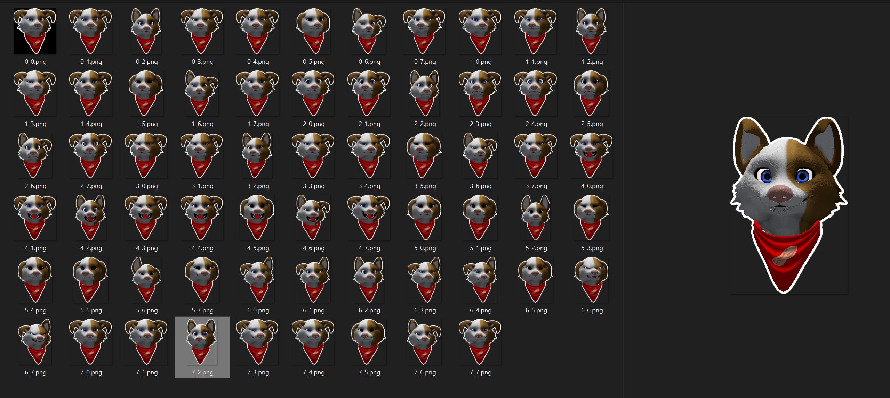

# VRC Avatar Sticker Generator

Generates Telegram stickers from a VRChat (or ChilloutVR) avatar. It loops through each hand gesture and plays the animation on your avatar and outputs a 512x512 transparent sticker with a white outline.

Tested in Unity 2019.4.31f1 on Windows 10 with the Canis Woof by Rezillo Ryker.

## Usage

1. Import the `.unitypackage` into your Unity project
2. Create a new scene
3. Add the prefab `PeanutTools/VRC_Avatar_Sticker_Generator/Sticker_Generator.prefab` and configure the settings:

- drag your VRChat avatar (or whatever Animator) into the Animator slot
- set the armature to hide (if you want this)
- in the animators list add in your FX, gestures, etc.

4. Enter play mode

Your stickers will be outputted to a new folder called "stickers" in the root of your project.

## FAQ

### How do I change the camera, lighting, etc.?

Everything is in the prefab. Change it as much as you like.

### How do I set the trigger amount?

Add "GestureLeftWeight" and "GestureRightWeight" as floats and set them to 1.

### How do I show accessories if my body is hidden?

Move them to the head bone.

## Ideas

- detect parameters
- list of accessories not to shrink

## Avatars

### Canis Woof

View a pack I made: https://telegram.me/addstickers/CanisWoof

- ortho camera:
  - position: 0,1.8,1
  - size: 0.3
- head set to bone "Neck"
- animators "Gestures" and "FX"
- camera offset 0.15
