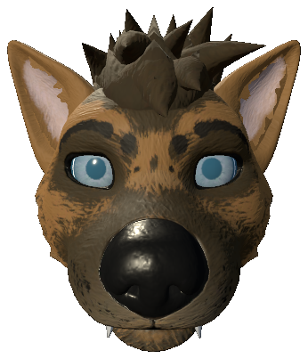

# VRC Avatar Sticker Generator

Generates Telegram stickers from a VRChat avatar:

I made some packs to show it off: 

- [https://t.me/addstickers/CanisWoof](https://t.me/addstickers/CanisWoof)
- [https://t.me/addstickers/ShibaInuVRC](https://t.me/addstickers/ShibaInuVRC) (ImageMagick'd)
- [https://t.me/addstickers/AwtterVRC](https://t.me/addstickers/AwtterVRC) (ImageMagick'd)

## Usage

1. Drop this folder into your Assets in your Unity project.
2. Go to PeanutTools -> VRC Avatar Sticker Generator.
3. Fill out the form.
4. Click "Create Stickers". Unity will go into Play Mode and will output to a Stickers folder (root of project).

## FAQ

### How do I show body accessories?

Your armature is hidden so just copy the object from the armature and have it float there so the camera can see it.

### How do I change the lighting / camera effects?

You can tweak the scene lighting except the reflections and camera are hardcoded for now.

## How it works

1. Adds a simple white outline to all renderers in the scene
2. Shrinks everything in the armature except for the head
3. Takes all of the animator controllers from the `VRC Avatar Descriptor`, flattens them, adds them to avatar 
4. For each gesture combination it sets the animator parameter
5. Exports as a PNG
6. Outline and resizing done by ImageMagick (included)
